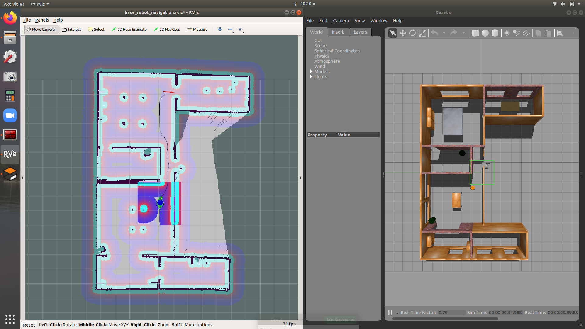

# base_robot navigation on Gazebo
Package containing launch files and configs required for navigation. 
This launch file will bringup,
 - base_robot in gazebo inside the house model
 - amcl (Adaptive Monte-Carlo Localization)
 - move_base
 - map_server with loading the model house map
 - rviz
 - teleop-twist-keyboard 

Feel free to use this setup for your diff_drive robot. 
 
You can control the robot using the keyboard (u,i,o,j,k.l,m,',','.') keys, but you need to focus on the terminal.

## Dependencies

 - [base_robot](https://github.com/IsuruKalhara/ros_gazebo_base_model)
 - [amcl](http://wiki.ros.org/amcl)
 - [ros_navigation](http://wiki.ros.org/navigation)
 - [turtlebot3_simulations](https://github.com/ROBOTIS-GIT/turtlebot3_simulations) (for the gazebo world file model)

## Preview

